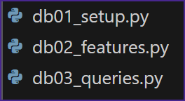
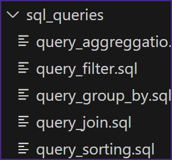
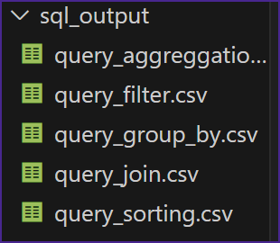

# datafun-05-sql Summer 1 - module 5

## Step 1: Initiated project

## Step 2: Created necessary files: sql and py

## Step 3: Plan and add sql files
SQL schema is based on author_id key in the authors.csv table.
Updated delete_records.sql and update_records.sql.
Updated db02_features.py

## Step 4: Create queries

## Step 5: Run queries



## CheatSheet: Managing Virtual Environment

For **Windows PowerShell** (adjust commands if using Mac/Linux):

1. **Create a virtual environment**:
   ```powershell
   py -m venv .venv
   ```

2. Activate the virtual environment:

   ```powershell
   .\.venv\Scripts\activate
   ```

3. Upgrade pip, setuptools, and wheel:

   ```powershell
   py -m pip install --upgrade pip setuptools wheel
   ```

4. Install required packages:

   ```powershell
   py -m pip install --upgrade -r requirements.txt
   ```

## CheatSheet: Running Python Scripts

Remember to activate your `.venv` (and install packages if they haven't been installed yet) before running files. Verify that all external packages imported into a file are included in `requirements.txt` (and have NOT been commented out).

Run Python scripts using the following commands:

   ```powershell
   py demo_script.py
   py do_stats.py
   py draw_chart.py
   py greet_user.py
   ```

## Every Work Session

Many projects span several days. When starting work again, remember to:

   <https://github.com/denisecase/pro-analytics-01/tree/main/03-repeatable-workflow>

   01-git-pull-before-changes.md
   02-activate-virtual-environment.md
   03-install-dependencies.md
   04a-activate-and-run-python-script.md
   05-modify-and-test.md
   06-git-add-commit-push.md

## CheatSheet: Git Add-Commit-Push

Use the following commands to add, commit, and push changes to Git:

   ```powershell
   git clone https://github.com/youraccount/yourrepo
   git add .
   git commit -m "custom message"
   git push -u origin main
   git pull origin main
   git push
   ```

## P4
